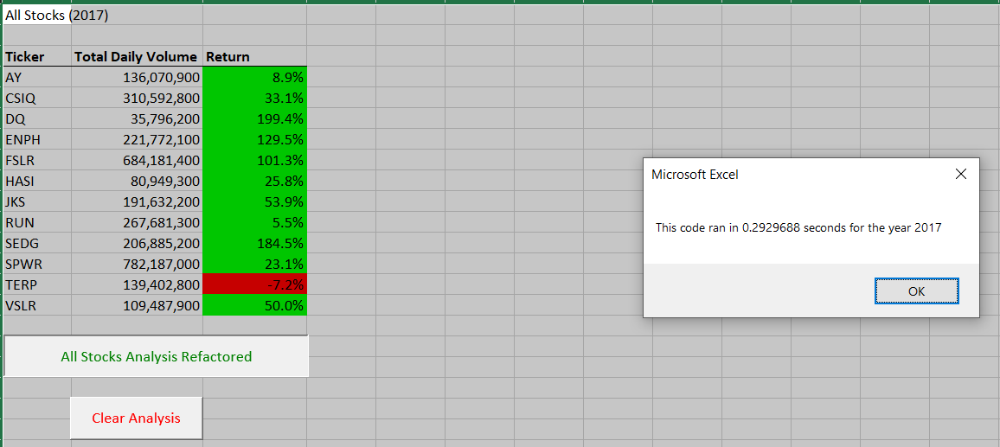
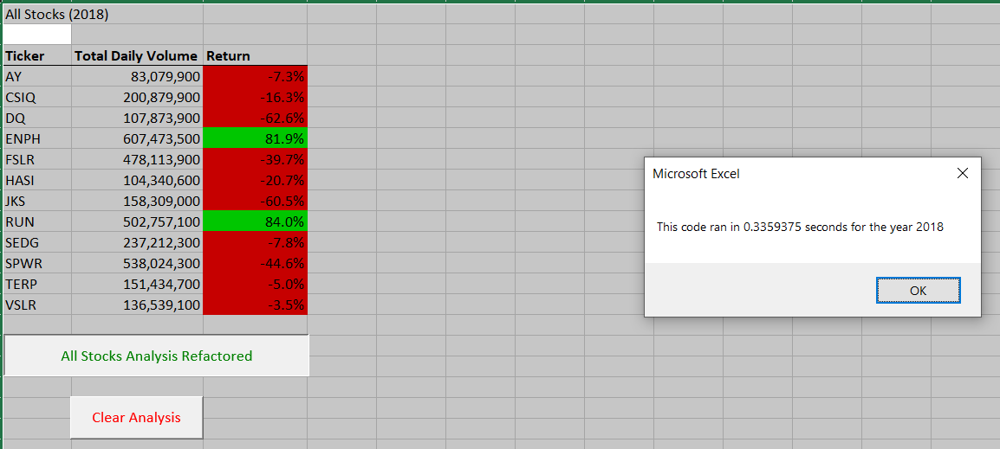

# Stocks Analysis

## Overview of Project

### Purpose

### Results: All Stocks Analysis Refactored 2017

### Results: All Stocks Analysis Refactored 2018

## Summary

- What are the advantages or disadvantages of refactoring code?

- How do these pros and cons apply to refactoring the original VBA script?

